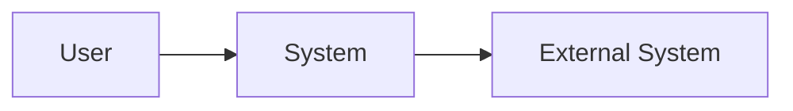
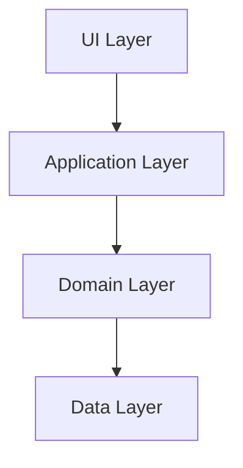
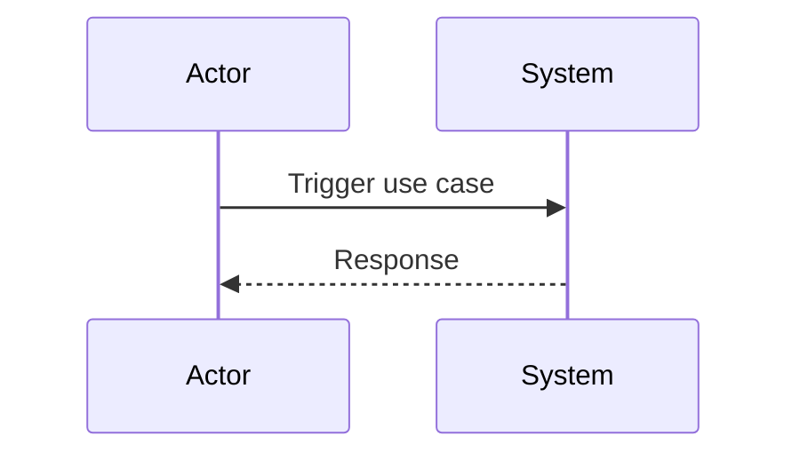
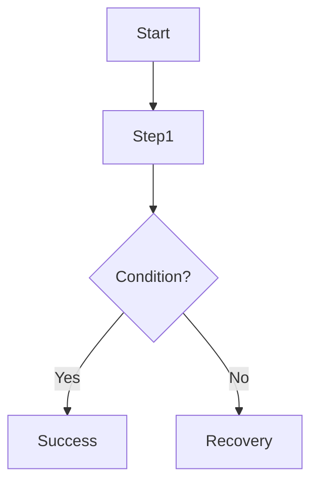

# Create Architecture and Design Documentation

## Purpose
Create a complete architecture and design document for a software system using best-practice documentation standards.

## Instructions
1. Gather context from the latest available project documents in the `docs` folder (for example `idea-xxxx.md`, `prd-xxxx.md`, `tech-principles-xxxx.md`, `plan-xxxx.md`, `tasklist-xxxx.md`), where "latest" means the highest numeric `xxxx` version.
2. If critical details are missing, ask clarifying questions before finalizing.
3. Produce a single Markdown document that is clear, concise, and maintainable.
4. Use Mermaid diagrams for all required visual sections.
5. Ensure terminology is consistent across text and diagrams.

## Required Content
The document **must** include:
- A **Context Diagram** (Mermaid) showing external actors/systems and system boundaries.
- The **Static Structure** of the application (Mermaid), such as containers/components/modules and their relationships.
- **Important Use Cases** with:
  - Brief textual description per use case
  - At least one Mermaid diagram per important use case (sequence diagram, flowchart, or state diagram)

## Output Guidelines
- Output must be valid Markdown.
- All diagrams must be Mermaid fenced blocks.
- Focus on architectural clarity: boundaries, responsibilities, interfaces, and interactions.
- Include assumptions and open questions when information is incomplete.
- Save the document as `architecture-design-xxxx.md` in the `docs/architecture` folder, where `xxxx` is the next sequential 4-digit version number based on the highest existing `architecture-design-xxxx.md` file (starting at `0001` if none exists).
- Assume the architecture document is in `docs/architecture` when creating relative reference links (for example `../idea-xxxx.md`).
- Include a timestamp at the end:
  - `Created on: [Date] - [Time]` using format `YYYY-MM-DD - HH:MM UTC` (24-hour)

## Strict Output Template
````markdown
# Architecture & Design Documentation for [Application Name]

## 1. Overview
- Purpose and scope
- Inputs/references used

## 2. Architectural Context
### 2.1 Context Narrative

### 2.2 Context Diagram


## 3. Static Structure
### 3.1 Structural Narrative

### 3.2 Static Structure Diagram


## 4. Important Use Cases
### 4.1 [Use Case Name]
- Goal:
- Primary actor:
- Preconditions:
- Main success flow:
- Alternative/exception flows:

#### Diagram


### 4.2 [Use Case Name]
- Goal:
- Primary actor:
- Preconditions:
- Main success flow:
- Alternative/exception flows:

#### Diagram


## 5. Architectural Decisions and Rationale
- Key decisions and trade-offs

## 6. Assumptions and Open Questions
- Assumptions
- Open questions

## 7. References
- [idea-xxxx.md](../idea-xxxx.md)
- [prd-xxxx.md](../prd-xxxx.md)
- [tech-principles-xxxx.md](../tech-principles-xxxx.md)
- [plan-xxxx.md](../plan-xxxx.md)
- [tasklist-xxxx.md](../tasklist-xxxx.md)

---
Created on: [Date] - [Time]
````
